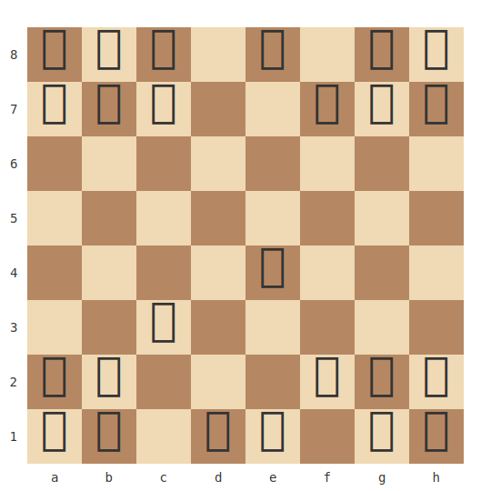
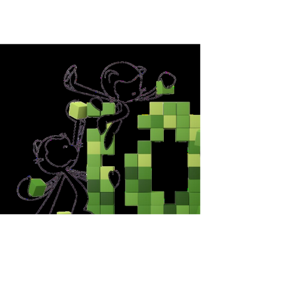

<h1 align="center">⚔️ One Board. One Bot. Victory or Oblivion — Choose Your Fate ⚔️</h1>

**Test your strategy. Face my undefeated AI by opening a GitHub Issue.**

## 🏁 Current Game Status

⚪ **White to move**

**Game Status:** White to move  
**Total Moves:** 2  
**Last Moves:** 1. e4 e5

## ░ Current Board

  

## 🎮 How to Play

1. **Make a Move**: Open a new [GitHub Issue](../../issues/new) with the title format: `Move: [your_move]`
   
   Examples:
   - `Move: e2e4` (pawn from e2 to e4)
   - `Move: Nf3` (knight to f3)
   - `Move: O-O` (kingside castling)
   - `Move: Qxd7+` (queen captures with check)

2. **Wait for Processing**

3. **Check the Board**: Return to this README to see the updated position!

## 📝 Move Format Guide

Use standard algebraic notation:
- **Pawn moves**: `e4`, `d5`, `exd5` (capture)
- **Piece moves**: `Nf3`, `Bb5`, `Qh5`, `Ra1`
- **Castling**: `O-O` (kingside), `O-O-O` (queenside)  
- **Promotions**: `e8=Q`, `a1=N`
- **Check/Checkmate**: Add `+` for check, `#` for checkmate

Or use UCI notation (from-to squares):
- `e2e4`, `g1f3`, `e1g1` (castling)

## 🏆 Leaderboard

| Rank | Player | Score | W/L/D | Win Rate | Moves |
|------|--------|-------|-------|----------|-------|
| 1 | AI | 15 | 0/0/0 | 0% | 15 |
| 2 | Player1 | 10 | 0/0/0 | 0% | 10 |
| 3 | TestPlayer1 | 4 | 0/2/0 | 0% | 4 |
| 4 | TestPlayer2 | 4 | 0/2/0 | 0% | 4 |
| 5 | Verma-MK | 1 | 0/0/0 | 0% | 1 |

## 📈 Game Statistics

- **Total Games Played**: 2
- **AI Win Rate**: 100.0% (2 wins)
- **Player Victories**: 0
- **Draws**: 0
- **Total Moves**: 34

***

**🎯 Your Move, Challenger. The AI Awaits —** [Open New Issue →](../../issues/new)

---

  
  

